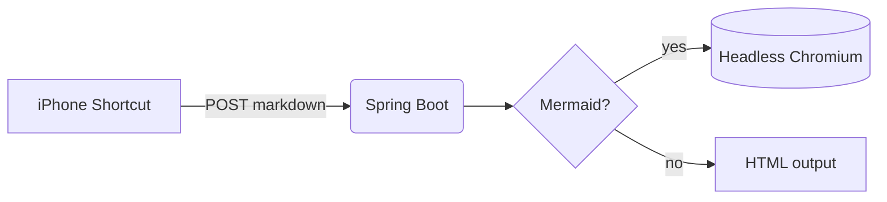
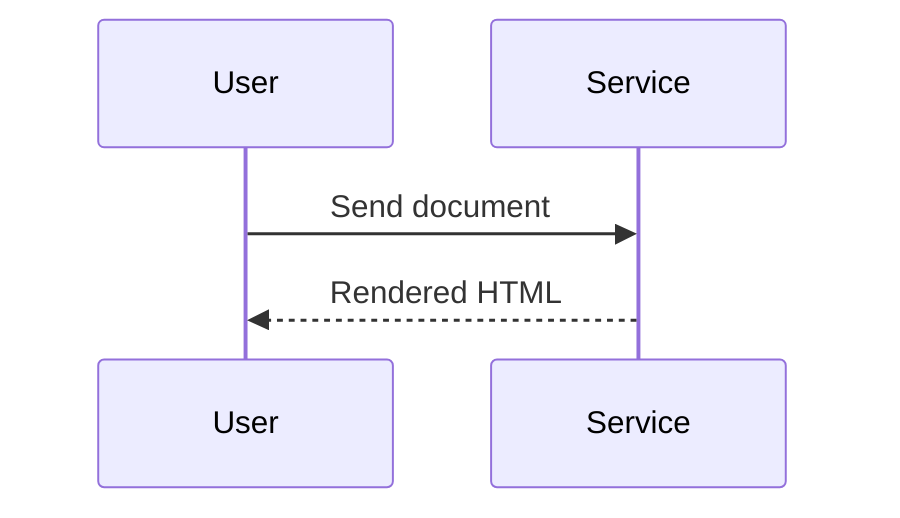

# Payment Service Design

This document describes the **payment flow** with `inline code` and a [link](https://example.com).

## Architecture



## Sequence



## Broken diagram

```mermaid
flowchart LR
    A -->-->--> ((( B
```

## Details

| Component | Purpose |
|-----------|---------|
| API       | Receives text |
| Renderer  | Draws diagrams |

- [x] Parse markdown
- [ ] Render PDF

```java
System.out.println("regular code stays as code");
```

> Note: everything stays in memory.
